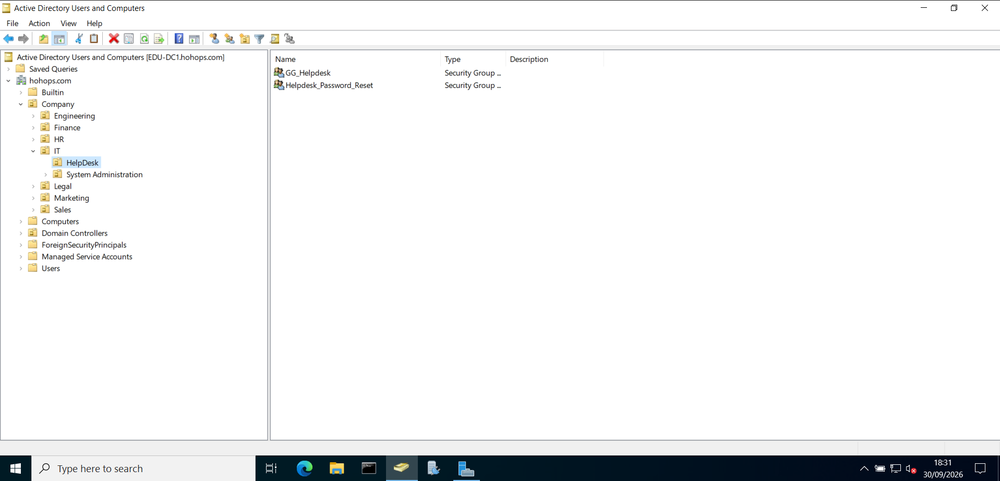
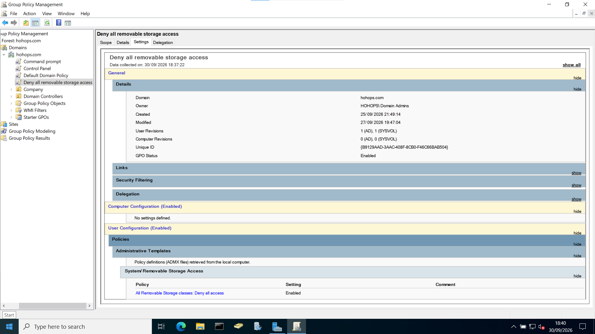

# Windows Server & Active Directory Enterprise Lab

## 1. Project Overview
**Purpose:** Build a foundational understanding of Active Directory, including user provisioning, Group Policy management, and DNS/DHCP configuration within a closed virtual lab environment.

**Hypervisor:** Oracle VirtualBox  
**Operating Systems:** Windows Server 2022 (Domain Controller), Windows 11 (Client)

## 2. Virtual Machine Architecture

| Role | Hostname | OS | CPU | RAM | Storage | Network Adapters |
|---|---|---|---|---|---|---|
| **Server / DC** | EDU-DC1 | Windows Server 2022 | AMD Ryzen 7 7730U (6 Cores) | ~5 GB | 50 GB Total (20 GB Used) | 1x Internal, 1x NAT |
| **Client** | Win11-PC1 | Windows 11 | AMD Ryzen 7 7730U (2 Cores) | ~4 GB | 80 GB Total (24 GB Used) | 1x Internal, 1x NAT |

## 3. Network & Domain Configuration
* **Domain Name:** `hohops.com`
* **Server Static IP:** `192.168.10.10`
* **Subnet Mask:** `255.255.255.0`
* **DNS Server:** `127.0.0.1` (Loopback)
* **Installed Roles:** Active Directory Domain Services (AD DS), DNS, DHCP

## 4. Active Directory Structure

### Organizational Units (OUs) & Provisioned Users
A dedicated OU and Security Group were created for each department to manage role-based access and policies.

* **IT:** Ramon M. Stacy
* **Sales:** Edwardo J. Briggs
* **HR:** Kristyn J. Boren
* **Engineering:** John L. Pritchett
* **Finance:** Chris L. Cortez
* **Marketing:** Carla J. Thomas
* **Legal:** Carolee J. Horton

### Group Policy Objects (GPOs)
The following GPOs are linked and enabled at the `hohops.com` domain level to enforce organizational security and standardization:
* Default Domain Policy
* Restrict Control Panel Access
* Disable Command Prompt
* Deny All Removable Storage Access

## 5. Troubleshooting & Lessons Learned

**Issue:** Unable to join the Windows 11 client VM (`Win11-PC1`) to the domain. Upon inspection of the DNS Manager on the server, the standard Active Directory folders (`_msdcs`, `_sites`, `_tcp`, and `_udp`) were missing from the Forward Lookup Zones.

**Resolution:** The DNS zone was not properly integrated with Active Directory. To resolve this, the domain zone properties were modified to enable **"Store the zone in Active Directory"**. This regenerated the missing SRV records and allowed the client VM to successfully discover the Domain Controller (`EDU-DC1`) and join the domain.
